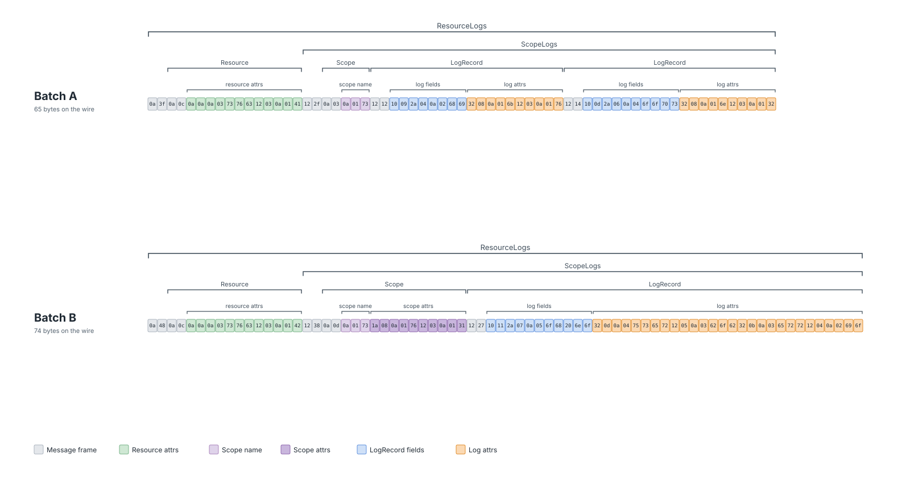
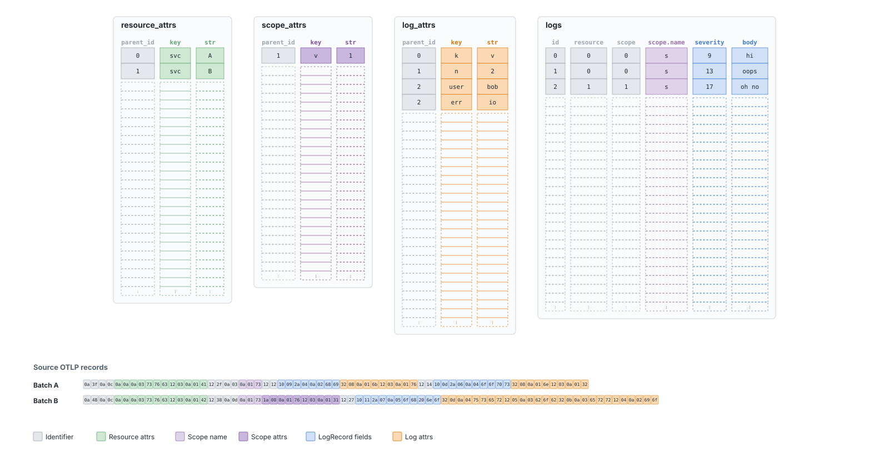
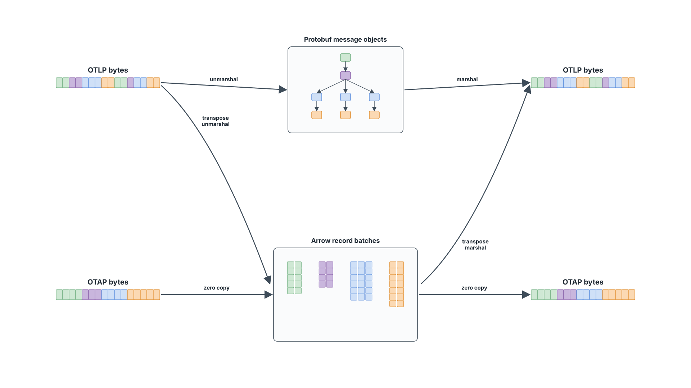

<!-- markdownlint-disable MD022 MD025 MD033 MD040 MD060 -->

# The Invisible Tax
## How Data Format Conversions Drive Up Telemetry Pipeline Costs

**Cijo Thomas** · Microsoft

[KubeCon + CloudNativeCon India 2026](https://kccncind2026.sched.com/event/2IW2j/the-invisible-tax-how-data-format-conversions-drive-up-telemetry-pipeline-costs-cijo-thomas-microsoft)

---

# Speaker

**Cijo Thomas** · Microsoft

Works across **multiple areas of OpenTelemetry** — language implementations (Rust, .NET), Specification, and OTel Arrow.

On the team behind Microsoft's **planetary-scale telemetry pipelines**.

---

# Why Talk About Pipelines?

Telemetry volume keeps growing. The industry has fought back hard on **storage** (tiered, columnar) and on **what gets ingested** (sampling, filtering, drop rules).

<v-click>

The pipeline itself — the path between the app and the backend — gets far less attention.

</v-click>

<v-click>

That's what this talk is about.

</v-click>

---

# What Pipelines Are For

> *Anything between the moment a telemetry signal is produced and the moment it lands in a queryable state in some backend — that's the pipeline.*

Pipelines do real, useful work between the app and the backend:

<v-clicks>

- **Transport**
- **Batch & compress**
- **Filter & sample**
- **Enrich**
- **Redact**
- **Route**
- **Transform**

</v-clicks>

---

# Pipelines Cost CPU. A Lot of It.

Every one of those operations runs on real CPU — in collectors, in sidecars, in regional aggregators, on every host. (Memory and network too — but CPU is usually the loudest.)

<v-click>

At scale, **pipeline CPU adds up fast** — running collectors at every hop, on every host, becomes a real line item in the observability bill.

</v-click>

<v-click>

So it's worth asking: **where does that CPU actually go?**

</v-click>

<!--
Speaker note: This is the bridge from "what pipelines do" to "what pipelines
cost". Without this, the next slide feels like it pivots to benchmarking
out of nowhere.
- "Comparable to the backend cost" — soft claim, deliberately vague. If
  pressed: depends heavily on workload and backend, but at multi-host scale
  the collector tier is non-trivial; we and others have seen it land in the
  same order of magnitude as ingestion-side costs.
- Then the natural next move: pick the simplest op, see what it costs.
-->

---

# How Cheap Is the Simplest Rename Operation?

<div grid="~ cols-2 gap-4" class="mt-2">

<div>

**before**

```rust
LogRecord {
  name: "user.login.attempt",
  severity_num: 9,
  attributes: [
    ("http.status_code", "200"),
    ("user.id", "u-12345"),
    ("exception.type",
     "java.io.IOException"),
  ],
}
```

</div>

<div>

<v-click>

**after**

```rust
LogRecord {
  name: "user.login.attempt",
  severity_num: 9,
  attributes: [
    ("http.status_code", "200"),
    ("user.id", "u-12345"),
    ("exception.kind",  // ← renamed
     "java.io.IOException"),
  ],
}
```

</v-click>

</div>

</div>

<v-click>

This rename takes **~30 ns** per record. A single CPU core, in a tight loop, can do **~30 million per second**.

</v-click>

<v-click>

So the actual rename cost is **negligible**.

</v-click>

<v-click>

…but anyone who has run a real telemetry pipeline knows a single core gets nowhere close to that.

</v-click>

---

# What Goes On Inside a Collector?

For every batch the pipeline receives:

<v-click>

- **Decode** protobuf bytes → allocate a full object graph
- Run any configured processors (filter, transform, route…)
- **Re-encode** back to bytes — and throw the whole object graph away

</v-click>

<v-click>



_Bytes look like this — opaque until decoded._

</v-click>

<v-click>

Even with **zero processors** in the middle — pure passthrough — the decode + re-encode + GC churn still happens on every batch, every hop.

</v-click>

<v-click>

Now add a rename rule: `exception.type → exception.kind`.
Throughput drops further. CPU climbs.

</v-click>

<v-click>

Conversion happens **once per batch** — adding rules doesn't add more conversions.

So why does **each rule** cost so much? The **in-memory shape itself** is expensive to walk.

</v-click>

<!--
Speaker notes:
- Opens by describing what a collector actually does on each batch.
- Then notes: even passthrough (no processors) pays decode + encode + GC churn.
  ~15-30% of CPU depending on workload — say verbally if asked.
- Then layer on the rule. The key insight: bytes were already decoded once and
  will be encoded once regardless. So extra CPU per rule isn't conversion —
  it's the cost of walking the in-memory object graph row by row.
- Sets up "structural problem" slides: it's not just the wire format, it's
  the in-memory representation that forces per-row work.
- Numbers — both passthrough cost and per-rule cost — come later in the talk.
-->

---

# Your Application Pays This Too

Anything emitting telemetry — through any OTel SDK — runs the same shape conversion before bytes leave the process:

`SDK record → protobuf struct → byte[]`

Two conversions per record, on every host emitting telemetry.

<v-click>

Measured cost per log record:

| SDK | Conv 1 (SDK → struct) | Conv 2 (struct → bytes) | % in Conv 1 | **Total** |
|---|---:|---:|---:|---:|
| **Rust** | 395 ns | 114 ns | **~77%** | **~510 ns** |
| **Go** | 281 ns | 598 ns | **~32%** | **~887 ns** |
| **.NET** (skips Conv 1) | — | — | **0%** | **~194 ns** |

_.NET emits the protobuf struct directly from the SDK — proof that Conv 1 is avoidable, not free._

</v-click>

---

# This Is a Structural Problem

Whether it's the Collector or an OTel SDK, the cost has the same three shapes:

<v-clicks>

1. **Conversion at every hop**
2. **GC pressure** — every batch allocates objects, every batch becomes garbage.
3. **Per-row work** — processors walk every record in the batch, one at a time.

</v-clicks>

<v-click>

The root cause: **every OTel component picks its own in-memory representation** — SDK types, Go pdata, backend ingestion schemas. So conversion happens **at every boundary** — not because anyone designed it that way, but because nobody agreed on a shared shape.

The wire format (OTLP protobuf) is *only* a wire format. It's nobody's in-memory home.

</v-click>

<!--
Speaker notes:
- The three shapes (conversion / GC / per-row) are symptoms. They all trace
  back to the same cause: no shared in-memory representation.
- Conversion: protobuf bytes → object graph → bytes. Mandatory at every hop.
- GC pressure: resource/scope/record/attribute objects allocated per batch.
- Per-row: rename one attribute = walk every record in the batch.
- Hold on to these three — we come back to them when comparing against Arrow.
-->

---

# What Would the Fix Look Like?

Wire transport is unavoidable — bytes have to cross processes and machines.
So we need an **in-memory representation** that:

<v-clicks>

- **Maps cheaply to/from the wire** — minimal decode and encode work at boundaries
- **Fits how pipelines actually work** — bulk per-column ops over batches, not per-record walks
- **Is language-neutral** — SDK in Rust, processor in Go, backend in Java all share the same shape with no conversion

</v-clicks>

<v-click>

**Good news: OTel is already building on one.**

</v-click>

---

# Apache Arrow, OTAP, and the Dataflow Engine

<v-clicks>

- **Apache Arrow** — a columnar, batch-oriented in-memory format. Same layout on the wire and in memory.
- **OTAP** — *OpenTelemetry Protocol with Apache Arrow*. A 100%-compatible OTLP alternative that carries telemetry as Arrow record batches.
- **Dataflow Engine (DFE)** — a new collector runtime that uses **OTAP as its in-memory representation**, so processors operate directly on Arrow batches.

</v-clicks>

<v-click>

Together: **no conversion at boundaries. No per-record allocation. Columns, not rows.**

</v-click>

[github.com/open-telemetry/otel-arrow](https://github.com/open-telemetry/otel-arrow)

---

# OTLP: OpenTelemetry Protocol


<div class="text-center text-sm opacity-75 mt-2">

_Nested protobuf — opaque until decoded, walked one record at a time._

</div>

<!--
Speaker notes:
- This is what one OTLP batch looks like on the wire: a packed protobuf tape.
- To do anything with it — read, filter, rename — the receiver must
  unmarshal/decode the entire tape first. Heap-allocate every resource, scope,
  record, attribute object.
- And once decoded, look at how the data lives: each attribute is its own
  object, scattered across the heap. To rename one attribute, the processor
  chases pointers through that scattered graph, record by record.
- Cache-unfriendly on read. Allocator-heavy on receive. GC-heavy on release.
- Every process boundary: receiver decodes, sender re-encodes. That's the tax.
-->

---

# OTAP: OpenTelemetry Protocol with Apache Arrow



<div class="text-center text-sm opacity-75 mt-2">

_Same data — columnar tables. Wire layout == memory layout._

</div>

<!--
Speaker notes:
- Same telemetry, restructured. Instead of one packed byte tape, OTAP arranges
  it as a few columnar tables: one for logs, one for attributes, plus the
  relationships between them.
- The wire bytes here are Arrow IPC — but unlike protobuf, the wire layout is
  the same shape as the in-memory layout. The receiver doesn't have to walk
  every record to extract values; the column buffer is already there.
- And it's batch-oriented: a million records share one column. That's why
  filters, renames, and other bulk ops can run as column operations instead of
  a per-record walk.
-->

---

# OTAP In, OTAP Out: No Conversion at All



<v-clicks>

- Wire bytes **map directly** to Arrow column buffers — no per-record decode
- Processors operate on those batches as **columns**, not as per-record object graphs
- No per-record allocation. No GC churn.

</v-clicks>

<!--
Speaker notes:
- Left side: an OTLP pipeline. Every time bytes arrive, unmarshal — heap-
  allocate the full object graph. To send: marshal back to bytes. Every hop
  pays both.
- Right side: an OTAP pipeline. Wire bytes parse straight into Arrow column
  buffers — and out the same way. No per-record decode, no per-record
  allocation.
- Same source data, same destination, but one path pays the conversion tax
  twice per hop and the other pays it zero times.
- (Honesty caveat if asked: "zero copy" is slightly aspirational — there's a
  small Flatbuffers metadata parse per batch, but no per-record work.)
-->


---

# Same Runtime. Only the Protocol Changes.

Both rows are the **same DFE**, on the **same cores**. Only the wire format differs:

<table class="mt-4">
<thead>
<tr><th class="text-left">Wire protocol</th><th class="text-right">Throughput @ 1 core</th></tr>
</thead>
<tbody>
<v-click>
<tr><td><strong>OTLP</strong> in/out (decode + convert at the boundary)</td><td class="text-right">121K logs/s</td></tr>
</v-click>
<v-click>
<tr><td><strong>OTAP</strong> in/out (Arrow end to end)</td><td class="text-right"><strong>2.47M logs/s — ~20×</strong></td></tr>
</v-click>
</tbody>
</table>

<!--
Speaker note: Land the "~20× from protocol alone" verbally after the OTAP row
reveals. Don't put it on the slide — the number speaks for itself.
- Also mention: the OTAP run is load-generator-limited — the real ceiling is
  higher. Worth saying out loud as honesty.
-->

---

# Why Arrow: Batch Operations Are Nearly Free

Arrow was designed for **bulk operations over columns**. Renames are exactly that.

Same workload — rename rules added one at a time. **CPU added per rule:**

<table class="mt-4">
<thead>
<tr><th class="text-right">Rules added</th><th class="text-right">OTel Collector (OTLP)</th><th class="text-right">DFE (OTAP)</th></tr>
</thead>
<tbody>
<v-click>
<tr><td class="text-right">+1</td><td class="text-right"><strong>+3.75%</strong></td><td class="text-right"><strong>+0.07%</strong></td></tr>
</v-click>
<v-click>
<tr><td class="text-right">+2</td><td class="text-right"><strong>+7.5%</strong></td><td class="text-right"><strong>+0.14%</strong></td></tr>
</v-click>
<v-click>
<tr><td class="text-right">+3</td><td class="text-right"><strong>+11.25%</strong></td><td class="text-right"><strong>+0.21%</strong></td></tr>
</v-click>
</tbody>
</table>

<v-click>

OTLP representation walks each record — every rule stacks per-row work.
OTAP operates in columns — adding rules is essentially free.

</v-click>

<!--
Speaker note: This is the second reason Arrow was picked — not just no
conversion at the boundary, but the in-memory representation itself enables
batch ops. Adding more transforms is nearly free because the work is column
operations, not record walks.
- Numbers are from the Phase 2 blog measurements: Collector +3.75% per rule,
  DFE ~+0.07% per rule. Showing as incremental cost makes the point cleanly
  without the apples-to-oranges absolute baselines (Collector starts much
  higher than DFE because it pays a big upfront decode cost — irrelevant to
  the per-rule story).
-->

---

# Where Phase 2 Leaves Us

Everything you just saw is the result of **OTel Arrow Phase 2**:
OTAP on the wire, the Dataflow Engine, Arrow-native pipeline processing.

<v-click>

Deep dive: [OTel-Arrow Phase 2 blog](https://opentelemetry.io/blog/2026/otel-arrow-phase-2/)

</v-click>

<v-click>

But we're not done. **Phase 3 starts now.**

</v-click>

<!--
Speaker note: This is the landing for everything we've shown so far. The
20× wire result, the per-rule near-zero CPU — all in the Phase 2 blog.
The blog is the deep dive; the talk is the summary.
- Phase 3 is the next chapter. The deck shows one specific direction we care
  about — Arrow at the source — but it's not the only thing happening.
- Read out the URL or point to it; audience can hit the slide deck later.
-->

---

# Phase 3: Telemetry Born in Arrow

Phase 3 covers a lot of work. A few directions in scope:

<v-clicks>

- SDKs emit Arrow batches directly — no protobuf step at the app
- Pipelines stay in Arrow end to end — no per-hop conversion
- Backends ingest Arrow — many analytics engines already speak it natively
- **Pluggable components** — run existing collector-contrib components on the new engine

</v-clicks>

<v-click>

One representation, from source through every hop to query.
**Telemetry born in Arrow. Live end-to-end in Arrow.**

</v-click>

---

# Takeaways

<v-clicks>

- The conversion tax is real, structural, and applies to **every** OTel component — SDKs, collectors, backends.
- The fix is a **shared, columnar, language-neutral in-memory format**. Apache Arrow is the obvious candidate.
- OTel Arrow is exploring exactly this. Early results: **~20× throughput, near-free transforms** on the Arrow-native runtime.
- It's **early** — incubation, not production. The interesting work is just starting.

</v-clicks>

<v-click>

_Like a currency conversion fee: invisible per transaction, painful at scale — and worth removing._

</v-click>

---

# Get Involved

OTel Arrow is **work-in-progress** — early enough that your input shapes it.

<v-clicks>

- **Telemetry backends**: consider adopting **OTAP as your native ingestion format**. It's early — you can help shape it before the patterns harden.
- **Pipeline operators**: try the **OTAP path / Dataflow Engine** in a non-production setup and share feedback — real-world workloads are exactly what the project needs.
- **Everyone else**: join the community — issues, design discussions, benchmarks all welcome.

</v-clicks>

- [github.com/open-telemetry/otel-arrow](https://github.com/open-telemetry/otel-arrow)
- [CNCF Slack #otel-arrow](https://cloud-native.slack.com/archives/C02JADSFY8Y)

---

# Thank You & Q&A

**Cijo Thomas** · [@cijothomas](https://github.com/cijothomas) · Microsoft

[github.com/open-telemetry/otel-arrow](https://github.com/open-telemetry/otel-arrow)  
[CNCF Slack #otel-arrow](https://cloud-native.slack.com/archives/C02JADSFY8Y)
