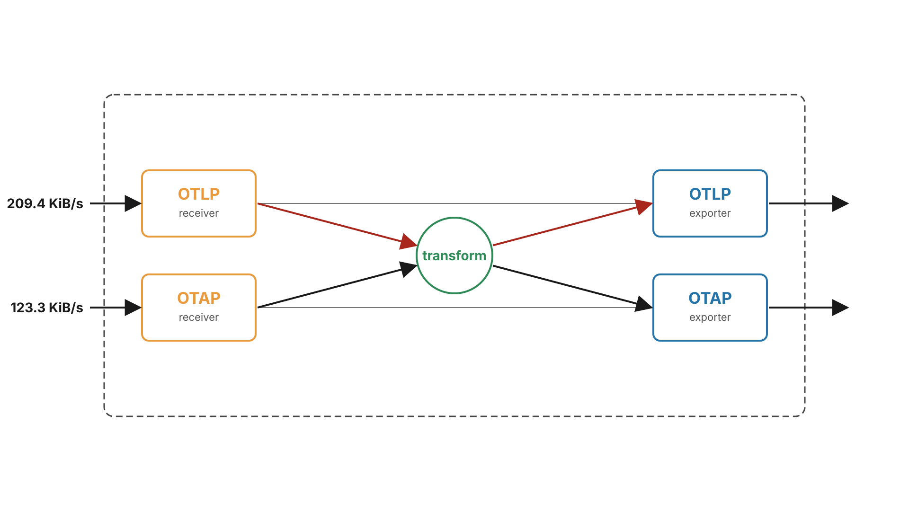
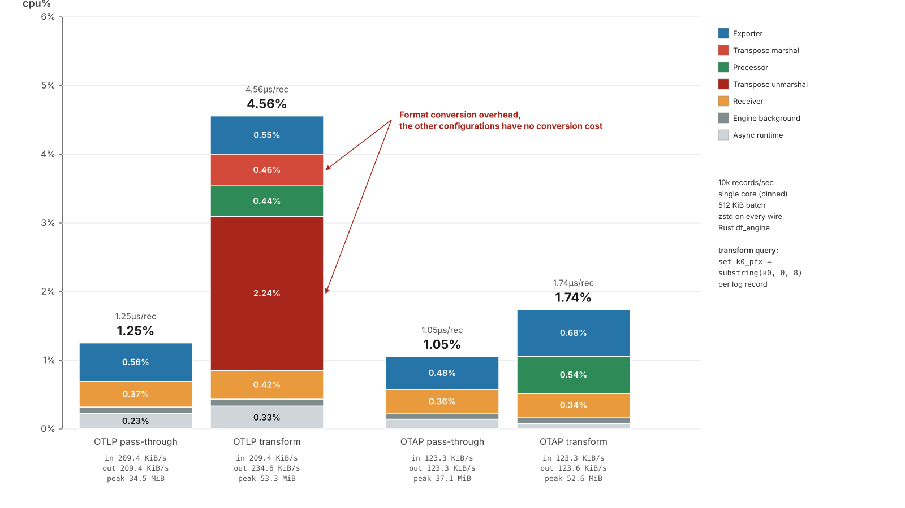

<!-- markdownlint-disable MD022 MD025 MD033 MD040 MD060 -->

# The Invisible Tax
## How Data Format Conversions Drive Up Telemetry Pipeline Costs

**Cijo Thomas** · Microsoft  
**Joshua MacDonald** · Microsoft

[Observability Summit NA 2026](https://observabilitysummitna26.sched.com/event/2HJUt/the-invisible-tax-how-data-format-conversions-drive-up-telemetry-pipeline-costs-cijo-thomas-joshua-macdonald-microsoft)

---

# Speakers

**Joshua MacDonald** · Microsoft

- OpenTelemetry Technical Committee member
- Maintainer, OTel Arrow
- Approver, OTel Collector

**Cijo Thomas** · Microsoft

- Maintainer, OTel Rust
- Approver - OTel Specification, OTel .NET and OTel Arrow

---

# A Tale of Currencies & Conversion Fees

<v-clicks>

- Every country runs on its own currency
- To do anything there, your money must be converted: Dollars → Euros → Pounds
- That conversion is a mandatory tax — it adds no value, it just costs you
- Your telemetry pipeline works the same way: each handoff = new format, mandatory conversion
- These conversions waste CPU and memory — and they compound hard with volume

</v-clicks>

---

# SDK-Side Costs

---

# SDK-Side Costs (Common Pattern)

<v-click>

- Most SDK/exporter paths commonly reduce to: `SDK representation → Protobuf representation → byte[]`

</v-click>

<v-click>

Measured cost to convert one realistic log record → OTLP bytes:

| SDK | Conv 1 (SDK → proto struct) | Conv 2 (proto struct → bytes) | % in Conv 1 | **Total** |
|---|---:|---:|---:|---:|
| **Rust** | 395 ns | 114 ns | **~77%** | **~510 ns** |
| **Go** | 281 ns | 598 ns | **~32%** | **~887 ns** |

</v-click>

<v-click>

**.NET** skips Conversion 1 and goes from its representation to byte[] **~194 ns total**.

</v-click>

<v-click>

SDK conversion cost is real but small relative to what happens next. **The real cost is across the rest of the pipeline.**

</v-click>

---

# Introducing OpenTelemetry Arrow

OpenTelemetry is building an end-to-end column-oriented telemetry
pipeline using Apache Arrow.

Terms:

- **OTAP**: OpenTelemetry Protocol with Apache Arrow is an efficient 100% compatible OTLP alternative.
- **Dataflow Engine**: a thread-per-core pipeline engine using OTAP as the in-memory representation.

 
Outline:

<v-clicks>

- Data conversion is a major contributor to total pipeline cost
- Two conversions per collector hop, can't change that, can change protocol
- OpenTelemetry Protocol with Apache Arrow designed to lower conversion costs
- Column-oriented data exchange and column-oriented data processing with Apache Arrow.
</v-clicks>

[github.com/open-telemetry/otel-arrow](https://github.com/open-telemetry/otel-arrow)

---

# OTLP: OpenTelemetry Protocol

---

# OTAP: OpenTelemetry Protocol with Apache Arrow

---

# Moving In and Out of Memory

---

# Experimental Setup

<v-clicks>

- OTAP `df_engine` 1cpu system, 10,000 records/s, 512 KiB batches,
  zstd input and output, 300s per trial
- Four combinations tested: {OTLP, OTAP} × {passthrough, `transform` processor}
- A one-line query that modifies an attribute:
  `logs | set attributes["k0_pfx"] = substring(attributes["k0"], 0, 8) | project-away attributes.k0`

</v-clicks>

---

# Pipeline Costs with OTLP and OTAP

---

# Get Involved

OTel Arrow is **work-in-progress** — not production-ready yet.

<v-clicks>

- If you're building a query/processing engine, consider **Arrow as your in-memory representation**
- If you have a choice of sending OTLP or OTAP, choose the protocol that **costs the least end-to-end**
- If you are a telemetry backend, **offer OTAP as an alternative to OTLP** to lower your and your user's conversion costs

</v-clicks>

[github.com/open-telemetry/otel-arrow](https://github.com/open-telemetry/otel-arrow) · [CNCF Slack #otel-arrow](https://cloud-native.slack.com/archives/C02JADSFY8Y)

---

# Key Takeaways

<v-clicks>

- Every component needs data in its own format — with no universal representation, every handoff means a conversion
- As we showed, that cost is **non-trivial** — up to half the CPU in extreme cases
- The fix: agree on a **single format** every component operates on directly — like the Euro replacing currency exchanges across Europe
- That format must be right for the job — columnar, highly compressible, performant for processing. **Apache Arrow fits.**
- OTel Arrow is defining that single currency — from your SDK, through processing pipelines, to your backend

</v-clicks>

---

# Thank You & Q&A

**Cijo Thomas** · [@cijothomas](https://github.com/cijothomas) · Microsoft  
**Joshua MacDonald** · [@jmacd](https://github.com/jmacd) · Microsoft

[OTel Arrow](https://github.com/open-telemetry/otel-arrow)
